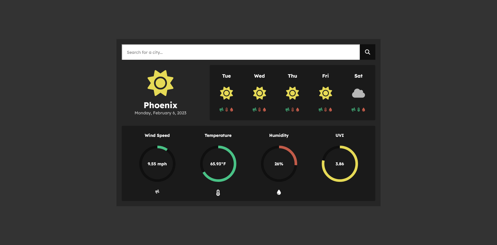

<h1>Weather Pal ☀️</h1>

<h1>Tech Stack 💻</h1>

<h1>About 📖</h1>

<h3>Weather Pal is a simplified weather dashboard.</h3> Weather Pal uses the OpenWeatherMap API for fetching weather data and uses Svelte for displaying the data. Users can view weather data for cities which includes the current day and 5-day forecast. Aside from the current weather, the use can also view data such as UVI (UV Index), the temperature, the wind speed, and the humidity.

<h1>Deployed Page 🏡</h1>
<h2><a href="https://staticcloud.github.io/Weather-Pal/">Check out the app here!</a></h2>

<h1>License ⚖️</h1>

<h3>This project is licensed under the MIT license. <a href="https://github.com/StaticCloud/Weather-Dashboard/blob/main/LICENSE.txt">Read more here.</a></h3>

 

Made with ❤️ by StaticCloud

